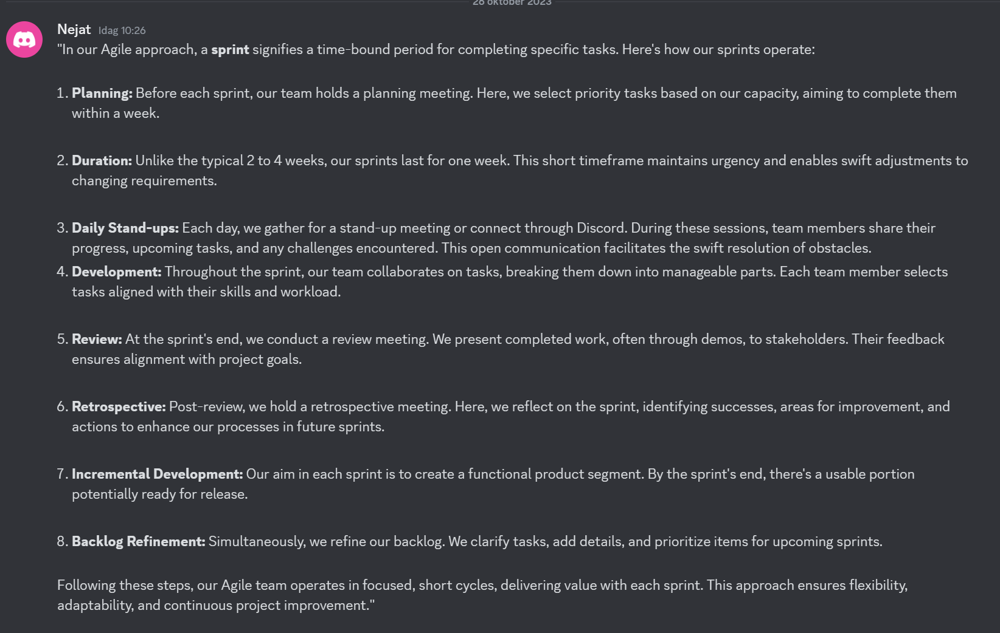

# Sprint 1

## Meeting monday 23 oct 9:00

Time 9:00-12:00

*We had a meeting friday 20 oct to get to know eachother and start with interview questions.*

*Louise fixed Discord server and webhook to GitHub-Repo during weekend.*

*Nejat did first interview in the weekend.*

- We decieded do have a Kanban style project.

- Checking out other catering sites for inspirations as a group.

  https://nuphoriq.com/catering-websites/

  https://nilead.com/industry/catering-website-design

- One user story and 1 perosna ready, discuss it in group.

---

### Persona 1

**Name:** Alamin

**Age:** 45

**Family:** Married, 1 kid

**Lives:** Apartment in Stockholm

**Job:** Event Planner

### Background 1

Alamin has been working in event planning for three years. He specializes in organizing corporate events and weddings. He prefers to organize his events through digital platforms. Alamin is always looking for a reliable catering service for his events. He values professionalism, on-time deliveries, and diverse menu options.

### Behavioural types 1

1. **Use of digital platforms:** Alamin is comfortable using various digital tools and platforms to streamline his event planning tasks.

2. **Busy Professional:** Due to his hectic schedule, Alamin values efficiency and responsiveness in the services he uses.

3. **Quality Expert:** Alamin places great importance on the quality of food and service when selecting catering companies for his events.

4. **Budget conscious:** While quality is important, Alamin also appreciates competitive pricing within his budget constraints.

### User story 1

- As a user, I would like to easily browse through the catering menus online so I can quickly assess the options for my event

  - Acceptance Criteria: The website should have clear, well-categorised menus with detailed descriptions and prices

- As a user, I would like to see reviews and ratings from     other customers to assess the quality of the catering service.
  - Acceptance Criteria: The website should display genuine customer reviews and ratings for each catering company.*

- As a user, I want to be able to customize menu options based on dietary preferences and the type of event I'm organizing.

  - Acceptance Criteria: The website should allow users to add special dietary requests and customize menu items according to their event requirements.*

- As a user, I want a straightforward booking process, enabling me to confirm catering services for my event efficiently.

  - Acceptance Criteria: The website should have a user-friendly booking system with clear steps, confirmation notifications, and payment options.

- As a user, I want to receive timely responses to my inquiries and have a reliable point of contact for any questions or concerns I might have.

  - Acceptance Criteria: The website should provide contact details and guarantee timely responses to user inquiries, ensuring a smooth communication process.

- As a user, I want to view sample event setups and food presentations to assess the catering company's style and suitability for my event theme.

  - Acceptance Criteria: The website should showcase high-quality images of past events catered by the companies, demonstrating their expertise in presentation and setup.

- As a user, I want to have access to exclusive offers or discounts for large  orders or regular events.

  - Acceptance Criteria: The website should feature a section for special offers and discounts, encouraging users to consider catering services for multiple events.

This user story was based on Alamin's needs and preferences. The goal was to create a website for a company that would meet the needs of busy, quality-conscious professionals like him.

---

### Assignment before next meeting

- Louise: does a interview based on Nejats interview questions.
- Khaled: saves images and menu from the current webpage.
- Nejat: saves some text from current page to re-use.
- Mikael: logos, prototype in Figma.
- Matewos: fix automate projectboard Kanban style.

---

## Meeting 25 oct 12:00

New persona and user story

### Persona 2

**Name:** Linda

**Age:** 41

**Family:** Single

**Lives:** Apartment in Gothenburg

**Job:** Bar manager

### Background 2

Linda has been working in resturants and bars for 20 years. She is currently a bar manager in Gothenburg and also has exeperience managing big events and do catering for conferances, weddings, funerals etc. She is then in charge of the staff, work divition, with more. Linda is dependent on good proffesional catering buiness to be able to deleiver her services to the customer. She values good communication, good service and that people are on time.

### Behavioural types 2

1. **Use of digital platforms:** Linda is comfortable using various digital tools and platforms and uses different apps and webpages to order from.

2. **Busy Professional:** Due to late hours and hectic days in the bar and also working different events it needs to be userfriendly and easy to use.

3. **Quality Expert:** Linda needs high quality to meet the request and expectation of her guest and customers..

4. **Budget conscious:** Working in fine dining quality is upmost important.

### User story 2

- As a user, I would like to easily browse through the bar and food suppliers page or app and order directly.

  - Acceptance Criteria: The website need to be easy and userfriendly.

- As a user, I would like to see if any other resturangs or bars had any problems with deliveries or if they are satiesfied.

  - Acceptance Criteria: The website should display customer reviews and ratings for each resturant and bar.

- As a user, I want to easily be able to see if the food or beverage has any allergens.

  - Acceptance Criteria: The website should allow users to add special diet or allergens to avoid to make ordering easy and quick.

- As a user, I want a clear and easy order system where I can see everything with price and name before click order.

  - Acceptance Criteria: The website should have a user-friendly booking system with clear steps, confirmation notifications, and payment options.

- As a user, I want to have a contact both phone and online to be able to answer questions when you sometimes have emergencies.

  - Acceptance Criteria: The website should provide clear and easy to find contact page with both phone and email.

- As a user, I want to see visuals of the products before I order.

  - Acceptance Criteria: The website should have a funtion exampel hoover over text to show the products..

- As a user, I want to have discount for big orders and emails if there is special price on something.

  - Acceptance Criteria: The website should feature a section for special offers and discounts, and also send me notifications on email and phone.

This user story was based on Lindas needs and preferences. The goal was to create a website for a company that would meet the needs of a manager and person in charge of purchase for their resturant or event.

---

Images for webpage

Prototype

Method to work

### New assignments

Before friday we work on basic design and structure based on the user stories and personas. Discussions and work is divied in Discord.

## Meeting 27 oct friday

### Stand up meeting friday 9:00

- Start code welcome page
  
  - Structure
  
- Issues

- Update GitHub project board if needed

### Afternoon

- Sprint retrospective:

  - Whats good/bad

  - Workflow
  
  - Workload
  
  - Timetable

  - Improvements/changes in any aspect of the project?
  - 
### Feedback

 - Nejat-Feedback
During the Agile sprint retrospective, the team discussed both positive and negative aspects of the sprint, focusing on workflow, workload, and timetable. We examined what went well and what could have been improved in these areas. In terms of improvements and changes, the team collectively brainstormed ideas to enhance the project's overall efficiency, considering adjustments in workflow, workload distribution, and scheduling.

